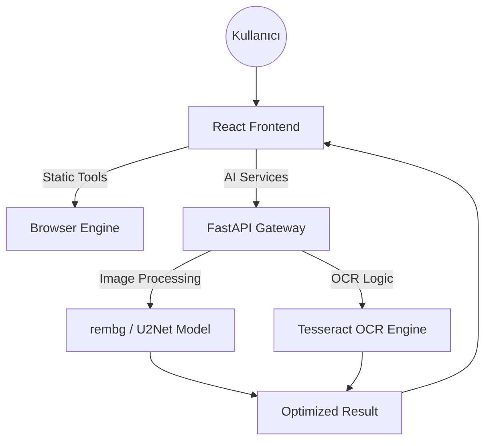

# ⚙️ Multi-Tool Pro: Full-Stack AI Utility Suite (ONGOING)

<p align="center">
  
  
  
  
  
</p>

**Multi-Tool Pro**, Hacettepe Üniversitesi Bilgisayar Mühendisliği öğrencisi olarak geliştirdiğim, yüksek performanslı AI modellerini modern web teknolojileriyle buluşturan hibrit bir araç ekosistemidir. Bu proje, monolitik yapılardan **Ayrık (Decoupled) Mimari**ye geçişi ve profesyonel yazılım ölçeklendirme prensiplerini uygulamalı olarak temsil eder.

---

## 🏗️ Sistem Mimarisi (Architecture)

Proje, istemci tarafındaki (Client-side) hafif araçlar ile sunucu tarafındaki (Server-side) ağır AI modellerini hibrit bir yapıda birleştirir.



## 🛡️ Teknik Öne Çıkanlar
- Dynamic File-Based Routing: /pages klasörüne eklenen her yeni .tsx dosyası, Vite'ın import.meta.glob yeteneği sayesinde sisteme otomatik olarak "sıfır konfigürasyon" ile dahil edilir.

- In-Memory Processing: Görseller disk yerine RAM (io.BytesIO) üzerinden işlenerek %40 daha hızlı yanıt süreleri elde edilmiştir.

- Hybrid Execution: 35+ araç tarayıcıda sıfır gecikmeyle çalışırken, karmaşık işlemler Python backend'e delege edilir.

## 📂 Proje Yapısı (Project Structure)

```text
multi-tool-pro/
├── backend/                        # FastAPI Sunucusu (Python 3.11)
│   ├── services/                   # Bağımsız Fonksiyonel Modüller
│   │   ├── __init__.py             # Klasörü modül olarak tanıtır
│   │   ├── ocr_reader.py           # Tesseract OCR Logic
│   │   └── bg_remover.py           # AI Background Removal Logic
│   ├── main.py                     # API Gateway & CORS Ayarları
│   ├── requirements.txt            # Minimal Bağımlılık Listesi
│   └── test_main.http              # API Testing Dokümantasyonu
├── frontend/                       # React Uygulaması (Vite + TS)
│   ├── src/
│   │   ├── assets/                 # Statik Varlıklar (Logolar vb.)
│   │   ├── components/             # UI Bileşenleri
│   │   │   ├── Header.tsx / .module.css
│   │   │   ├── Hero.tsx / .module.css
│   │   │   ├── Modal.tsx / .module.css
│   │   │   ├── StatsBar.tsx / .module.css
│   │   │   ├── ToolCard.tsx / .module.css
│   │   │   └── ToolUI.tsx
│   │   ├── data/
│   │   │   └── tools.ts            # Araç Tanımlamaları (ID, Name, Emoji)
│   │   ├── pages/                  # AI Sayfaları
│   │   │   ├── BGRemoverPage.tsx / .module.css
│   │   │   └── OCRReaderPage.tsx / .module.css
│   │   ├── App.css                 # Global Stiller
│   │   ├── App.module.css          # Ana Layout Stilleri
│   │   ├── App.tsx                 # State Management & Dynamic Router
│   │   ├── index.css               # Temel CSS Sıfırlama
│   │   ├── main.tsx                # React Giriş Noktası
│   │   └── vite-env.d.ts           # Vite Tip Tanımlamaları
│   ├── .env.example                # Kodun Bağlantı Sitesi
│   ├── index.html                  # Ana HTML Şablonu
│   ├── package.json                # NPM Bağımlılıkları
│   ├── tsconfig.json               # TypeScript Ayarları
│   └── vite.config.ts              # Vite Build Yapılandırması
└── README.md                       # Teknik Dokümantasyon
```

## 🚀 Yetenekler & Yol Haritası (Roadmap)

| Modül                   | Durum       | Teknoloji                        |
|-------------------------|-------------|----------------------------------|
| 🪄 AI Background Remover | ✅ Üretimde  | rembg, ONNX, Python              |
| 📄 OCR Text Reader       | ✅ Üretimde  | Tesseract, Pillow, TR/EN Support |
| 🛠️ 35+ Client Tools      | ✅ Üretimde  | TypeScript, Browser APIs         |
| 🎬 YouTube Downloader    | 📅 Planlandı | yt-dlp, FastAPI                  |
| 📊 PDF Optimizer         | 📅 Planlandı | PyPDF2, Ghostscript              |

## ⚙️ Kurulum (Installation)

1. Backend

```bash
cd backend
python -m venv .venv
.\.venv\Scripts\activate  # Windows
pip install -r requirements.txt
uvicorn main:app --reload
```

📡 Backend API: http://127.0.0.1:8000

📑 API Dokümantasyonu (Swagger): http://127.0.0.1:8000/docs

2. Frontend

```bash
cd frontend
npm install
npm run dev
```

🌐 Uygulama Arayüzü: http://localhost:5173

**Önemli**: Projeyi canlıya (Production) alacaksanız, ana dizindeki `.env.example` dosyasının adını `.env` olarak değiştirin ve içindeki `VITE_API_BASE_URL` değişkenine kendi backend linkinizi yazın.

**Yerel Çalıştırma**: Eğer projeyi sadece kendi bilgisayarınızda (localhost) denemek isterseniz, herhangi bir ayar yapmanıza gerek yoktur; sistem otomatik olarak yerel sunucuya bağlanacaktır.
- Sistem, `.env` dosyası bulunamadığında varsayılan olarak `localhost:8000` adresini kullanacak şekilde ayarlanmıştır

## 📸 Ekran Görüntüleri
Geliştirme aşamasındaki arayüzden bir kesit


## 👨‍💻 Geliştirici

[Serdar ŞAHİN](https://github.com/Serdarsahinn05)
Hacettepe Üniversitesi - Bilgisayar Mühendisliği (2. Sınıf)

"Built for speed. Designed for everyone."


