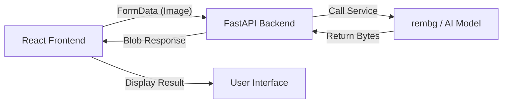

# 🛠️ Multi-Tool Pro: Full-Stack AI Utility Suite


Hacettepe Üniversitesi Bilgisayar Mühendisliği öğrencisi olarak geliştirdiğim, modern web mimarisi (FastAPI + React) ile AI modellerini birleştiren profesyonel bir araç setidir. Bu proje, monolitik Python yapısından **Mikroservis Mimarisi**ne geçiş sürecini ve ölçeklenebilir yazılım prensiplerini temsil eder.

---

## 🏗️ Mimari Yapı (Architecture)

Proje, Frontend ve Backend'in tamamen birbirinden ayrıldığı (Decoupled), REST API üzerinden haberleşen modern bir yapıya sahiptir.



- **Frontend:** React 18, TypeScript, Vite, Axios
- **Backend:** FastAPI, Python 3.11, Uvicorn (ASGI)
- **AI Core:** rembg (U2Net), Pillow, ONNX Runtime

---

## 📂 Proje Yapısı (Project Structure)

```text
multi-tool-pro/
├── backend/                # FastAPI Sunucusu (Python 3.11)
│   ├── services/           # Bağımsız Fonksiyonel Modüller (Logic Layer)
│   │   ├── __init__.py
│   │   └── bg_remover.py   # AI Background Removal Servisi
│   ├── main.py             # API Gateway & CORS Ayarları
│   ├── requirements.txt    # Minimal Bağımlılık Listesi
│   └── test_main.http      # API Testing & Dokümantasyon
├── frontend/               # React Uygulaması (Vite + TS)
│   ├── src/
│   │   ├── assets/         # Statik Varlıklar (Görseller, Logolar)(Daha eklenmedi)
│   │   ├── App.css         # Uygulama Bazlı Özel Stiller
│   │   ├── App.tsx         # State Management & API Entegrasyonu
│   │   ├── index.css       # Global CSS Tanımlamaları
│   │   └── main.tsx        # React Giriş Noktası
│   ├── index.html          # Ana HTML Şablonu
│   ├── package.json        # Proje Bağımlılıkları ve Scriptler
│   ├── package-lock.json   # Kilitlenmiş Bağımlılık Versiyonları
│   ├── tsconfig.json       # TypeScript Derleyici Yapılandırması
│   └── vite.config.ts      # Vite Build ve Server Ayarları
└── README.md               # Teknik Dokümantasyon
```

## 🚀 Mevcut ve Gelecek Özellikler (Roadmap)

| Özellik               | Durum            | Teknoloji             |
|-----------------------|------------------|-----------------------|
| AI Background Remover | ✅ Tamamlandı     | rembg, ONNX, FastAPI  |
| OCR Text Reader       | 🕒 Geliştiriliyor | Tesseract OCR, Python |
| YouTube Downloader    | 📅 Planlandı      | pytube / yt-dlp       |
| PDF Utilities         | 📅 Planlandı      | PyPDF2                |
| Image Optimizer       | 📅 Planlandı      | Pillow                |


# 🛠️ Yerel Kurulum (Local Setup)
## 1. Backend Kurulumu
```Bash
cd backend
python -m venv .venv
.\.venv\Scripts\activate  # Windows
pip install -r requirements.txt
uvicorn main:app --reload
```
📡 Backend API: http://127.0.0.1:8000

📑 API Dokümantasyonu (Swagger): http://127.0.0.1:8000/docs

## 2. Frontend Kurulumu
```Bash
cd frontend
npm install
npm run dev
```
🌐 Uygulama Arayüzü: http://localhost:5173

## 📸 Ekran Görüntüleri
Geliştirme aşamasındaki arayüzden bir kesit (Placeholder)

## 👨‍💻 Geliştirici Hakkında
[Serdar ŞAHİN](https://github.com/Serdarsahinn05) Hacettepe Üniversitesi - Bilgisayar Mühendisliği (2. Sınıf)

Bu proje, akademik bilgilerin endüstriyel standartlardaki Full-Stack mimarilere uygulanması amacıyla geliştirilmektedir.


